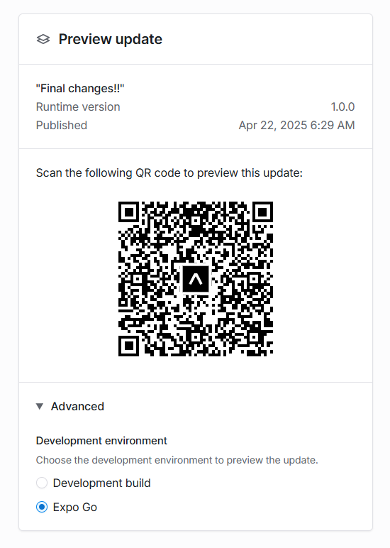

<h1>My Travel App</h1>

This repository contains a travel app that was created as part of my course at University of the West of Scotland.  To install the app on your device, please follow these steps:

<ol>
    <li>Visit the link <a href="https://expo.dev/preview/update?message=Final%20changes!!&updateRuntimeVersion=1.0.0&createdAt=2025-04-22T05%3A29%3A44.194Z&slug=exp&projectId=105e583f-b44d-4c4b-9405-2a0c949ed441&group=e4f63c2e-2c32-461e-a98e-f845b86a5440" target="_blank">here</a>.</li>
    <li>Use your camera on your phone to scan the QR code, which will allow you to preview the app on your device.</li>
    <li>If you are an advanced user, you can click <b>Advanced</b> and choose the development environment you wish to run.</li>
    <li>For this project, it is preferrable to choose Expo Go for the environment.</li>
</ol>

<section>
    <article>
        For Expo Go, you should see the web page illustrated on the right.
    </article>
    <article>
        
    </article>
</section>
