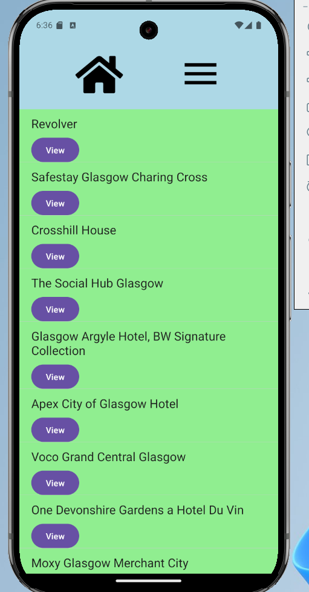
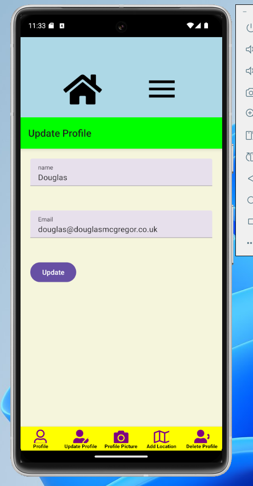
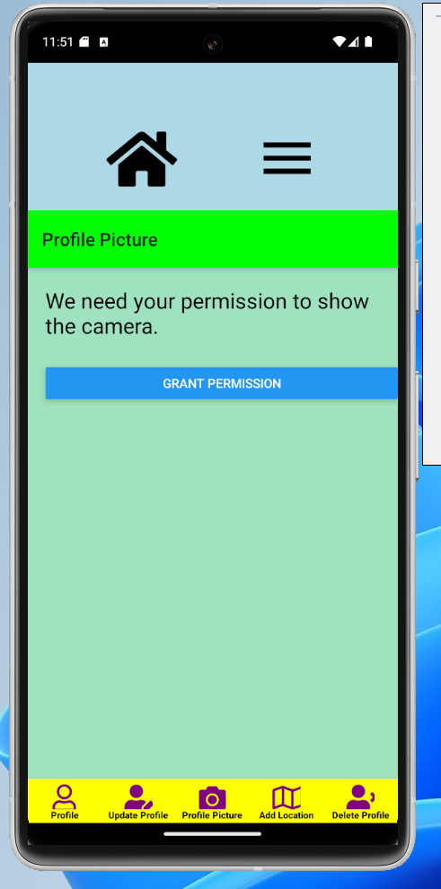
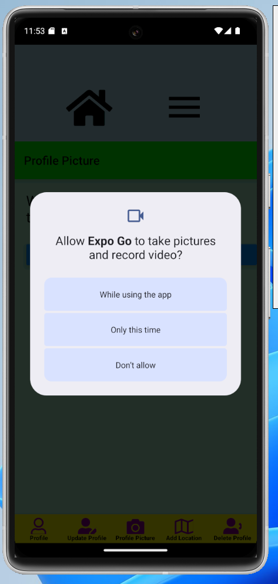
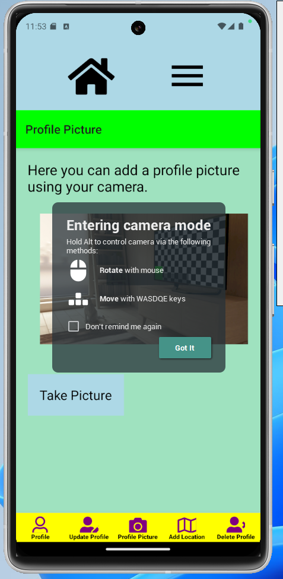
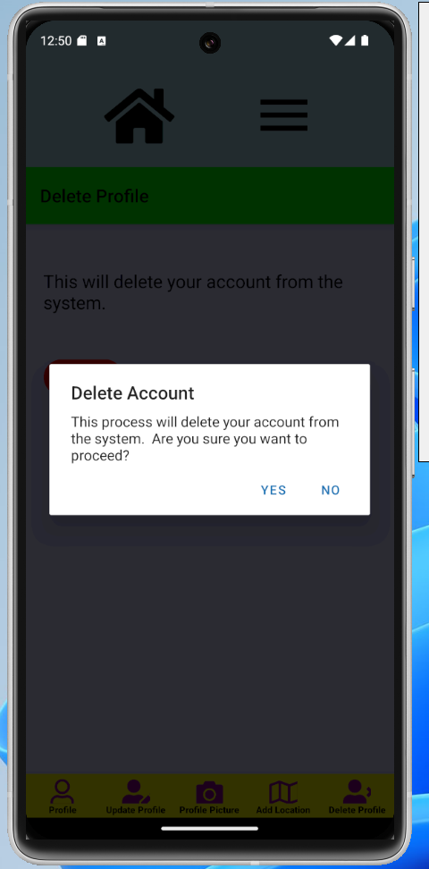

# My Travel App

This repository contains a travel app that was created as part of my course at University of the West of Scotland.  To install the app on your device, please follow these steps:

* Visit the link <a href="https://expo.dev/preview/update?message=Final%20changes!!&updateRuntimeVersion=1.0.0&createdAt=2025-04-22T05%3A29%3A44.194Z&slug=exp&projectId=105e583f-b44d-4c4b-9405-2a0c949ed441&group=e4f63c2e-2c32-461e-a98e-f845b86a5440" target="_blank">here</a>.
* Use your camera on your phone to scan the QR code, which will allow you to preview the app on your device.
* If you are an advanced user, you can click <b>Advanced</b> and choose the development environment you wish to run.
* For this project, it is preferrable to choose Expo Go for the environment.

<table>
    <tr>
        <td>For Expo Go, you should see the web page illustrated on the right.</td>
        <td>
    </tr>
</table>

Now you will find more detailed instructions of how to use the app below.

# Chosen Feature

<table>
    <tr>
        <td>1.  </td>
        <td>2.  </td>
        <td>3.  </td>
        <td>4.  </td>
    </tr>
</table>

# About Us Page

<table>
    <tr>
        <td></td>
        <td>The about us page is very generic, with lots of room for improvement.  It simply contains lorem ipsum generated text inside a scroll view.  It should be remembered that this app is a school project and will not necessarily be published.</td>
    </tr>
</table>

# Register Page

<table>
    <tr>
        <td>The register page attempts to improve the user interface design ever so slightly by adding icons to the input fields.  It is a standard registration page that validates user input and creates a new user account.  It should be noted that mobile development is very different to web development, so only one user can be created.</td>
        <td></td>
    </tr>
</table>

# Login Page

<table>
    <tr>
        <td></td>
        <td>Again, the login page has a very basic user interface with a simple login form to enter your email address and password.  The interface could be vastly improved by adding a link to reset your password.</td>
    </tr>
</table>

# Profile Page

<table>
    <tr>
        <td>   
After the user successfully logs in, they will be redirected to ther profile page.  This demonstrates basic read functionality in the application.  It could be made more engaging to improve it, but time has been a big constraint for this project.

        
Navigation tabs have been created at the bottom to navigate around the profile section.  This is popular on mobile apps, notably the Facebook mobile app has this UI design.

        
The navigation tabs are:

        <ul>
            <li>Profile</li>
            <li>Update Profile</li>
            <li>Profile Picture</li>
            <li>Add Location</li>
            <li>Delete Profile</li>
        </ul>
        </td>
        <td></td>
    </tr>
</table>

# Update Profile

<table>
    <tr>
        <td></td>
        <td>
The update profile screen demonstrates update functionality of CRUD operations.  It consists of really basic input fields to update your name and email address.  Attempts to improve the user interface experience have been added by clearing the field when the user touches it.

</td>
    </tr>
</table>

# Profile Picture 

<table>
    <tr>
        <td></td>
        <td></td>
        <td></td>
    </tr>
    <tr>
        <td></td>
        <td></td>
        <td><td>
    </tr>
</table>

# Add Location

<table>
    <tr>
        <td></td>
        <td></td>
        <td></td>
    </tr>
</table>

# Delete Profile

<table>
    <tr>
        <td></td>
        <td></td>
        <td></td>
    </tr>
</table>
